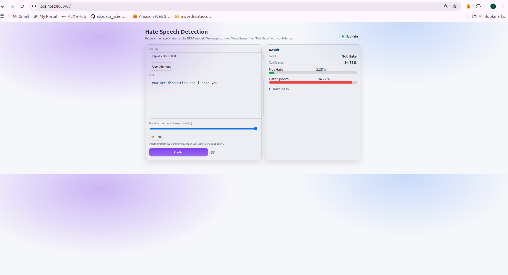

<!-- File: README.md | Purpose: Project overview and runbook -->

# Tweet Hate Speech Classifier (BERT) — DVC + MLflow + FastAPI + Web UI

This repository contains a small, production-style ML system for **binary hate-speech / offensive language detection** using **BERT** fine-tuning with:

- Hugging Face **Transformers** (`Trainer`)
- **DVC** for dataset + pipeline reproducibility
- **MLflow** for experiment tracking
- **FastAPI** model inference API
- A lightweight **HTML/JS website** served from the same FastAPI app

## Dataset

Input CSV columns:

- `tweet`: text input
- `label`: target label
  - `0` = not hate
  - `1` = hate / offensive

The dataset file is tracked with DVC.

- Tracked pointer: `data/raw/twitter_hate_speech.csv.dvc`
- Actual file (not committed to Git): `data/raw/twitter_hate_speech.csv`

## Project layout

- `src/hatespeech/preprocess.py`
  - Reads the raw CSV
  - Creates train/test split into `data/processed/`
- `src/hatespeech/train.py`
  - Tokenizes with BERT tokenizer
  - Fine-tunes `bert-base-uncased`
  - Logs to MLflow
  - Saves model to `models/bert`
  - Writes evaluation metrics to `metrics.json`
- `dvc.yaml`
  - DVC stages: `preprocess` and `train`
- `api/app.py`
  - FastAPI server
  - `POST /predict` for inference
  - Serves UI at `GET /ui/`
- `web/index.html`
  - Simple UI calling `/predict` via `fetch`

## Requirements

- Python 3.11 recommended
- CPU training works; GPU (CUDA) is faster if available

Install deps:

```bash
python -m venv .venv
source .venv/bin/activate
pip install -r requirements.txt
```

## DVC setup

Initialize DVC (first time):

```bash
dvc init
```

Add the dataset to DVC:

```bash
dvc add data/raw/twitter_hate_speech.csv
```

If Git is already tracking the file, untrack it first:

```bash
git rm --cached data/raw/twitter_hate_speech.csv
```

## Run the pipeline

Run the full pipeline:

```bash
python -m dvc repro
```

This will:

- create `data/processed/train.csv` and `data/processed/test.csv`
- fine-tune the model
- save the model to `models/bert/`
- write metrics to `metrics.json`
- update `dvc.lock`

## MLflow tracking

Training uses MLflow. By default it creates a local folder `mlruns/`.

To open the MLflow UI:

```bash
mlflow ui --host 0.0.0.0 --port 5000
```

Then open:

- http://localhost:5000

### Remote MLflow (optional)

If you want a remote MLflow server, set `mlflow.tracking_uri` in `params.yaml`.

## Model inference API (FastAPI)

Start the API:

```bash
uvicorn api.app:app --host 0.0.0.0 --port 8000
```

### Endpoints

- `GET /health`
- `POST /predict`
- `GET /docs` (Swagger UI)
- `GET /ui/` (HTML website)

### Example request

```bash
curl -X POST "http://localhost:8000/predict" \
  -H "Content-Type: application/json" \
  -d '{"text":"you are disgusting and i hate you"}'
```

Response format:

```json
{
  "label": 1,
  "score": 0.94,
  "scores": {
    "not_hate": 0.06,
    "hate": 0.94
  }
}
```

## Web UI

Once the API is running, open:

- http://localhost:8000/ui/



The UI:

- lets you paste text
- calls `POST /predict`
- shows:
  - **Hate Speech** / **Not Hate**
  - confidence
  - probability bars
  - an adjustable decision threshold

## Configuration

Main config is in `params.yaml`:

- dataset paths
- train/test split ratio
- BERT model name
- max length
- batch sizes
- learning rate
- epochs

## Troubleshooting

### 1) DVC error: cannot import name `_DIR_MARK`

Pin `pathspec` to a pre-1.0 version (already pinned in `requirements.txt`):

- `pathspec==0.11.2`

Reinstall:

```bash
pip install --force-reinstall "pathspec==0.11.2"
```

### 2) Transformers Trainer error: requires `accelerate`

Install/pin accelerate (already included in `requirements.txt`):

```bash
pip install "accelerate==0.33.0"
```

### 3) DVC stage cannot import `hatespeech`

This repo uses the `src/` layout.

DVC stages are configured to run with:

- `PYTHONPATH=src`

(Already set in `dvc.yaml`.)

## Git workflow

Typical:

```bash
git add -A
git commit -m "Your message"
git push
```

Note: the raw dataset file is tracked by DVC and should not be committed to Git.
